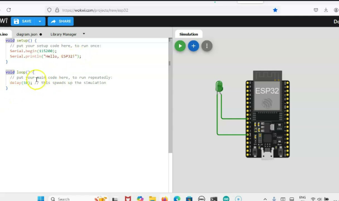

# Experiment 1: Blinking an LED at 1 Hz using Wokwi

## Aim
To interface an LED with a microcontroller (ESP32/Arduino) and write a program to blink it at a frequency of 1 Hz using the Wokwi online simulation platform.

## Components Required

| S.No | Component            | Quantity | Specification            |
|------|-----------------------|----------|---------------------------|
| 1    | Microcontroller Board  | 1        | ESP32 / Arduino Uno       |
| 2    | LED                    | 1        | Any color, 5mm            |
| 3    | Resistor               | 1        | 220 Ω (current limiting)  |
| 4    | Connecting Wires       | As needed| Jumper wires               |
| 5    | Breadboard             | 1        | Half/Full size            |
| 6    | Wokwi Simulator        | -        | Online platform (wokwi.com) |

## Theory
Blinking an LED at 1 Hz means the LED completes one full ON-OFF cycle every second. Since frequency (f) = 1/Time period (T), for f = 1 Hz, T = 1 second. This means the LED should stay ON for 0.5 seconds and OFF for 0.5 seconds to complete one cycle per second.

## Circuit Diagram
- Connect the anode (long leg) of the LED to a GPIO pin (e.g., GPIO 2 on ESP32) through a 220 Ω resistor.
- Connect the cathode (short leg) of the LED to GND.

## Procedure
1. Open [Wokwi](https://wokwi.com) and create a new **ESP32 / Arduino Uno** project.
2. Add an LED and a 220 Ω resistor to the circuit from the components panel.
3. Connect the LED's anode to a digital GPIO pin through the resistor, and the cathode to GND.
4. Write the Arduino code to toggle the GPIO pin HIGH and LOW with a 500 ms delay between each state (to achieve a 1 Hz frequency).
5. Upload/run the code in the Wokwi simulator.
6. Observe the LED blinking at 1-second intervals (ON for 0.5s, OFF for 0.5s).
7. Verify the timing using the simulator's time controls or a stopwatch.

## Code
```cpp
#define LED_PIN 2

void setup() {
  pinMode(LED_PIN, OUTPUT);
}

void loop() {
  digitalWrite(LED_PIN, HIGH);  // LED ON
  delay(500);                   // 0.5 second
  digitalWrite(LED_PIN, LOW);   // LED OFF
  delay(500);                   // 0.5 second
}
```

## Result
The LED was successfully interfaced with the microcontroller on the Wokwi platform and made to blink at a frequency of 1 Hz (ON for 0.5 seconds and OFF for 0.5 seconds), verifying the working of digital output control using `digitalWrite()` and timing control using `delay()`.


